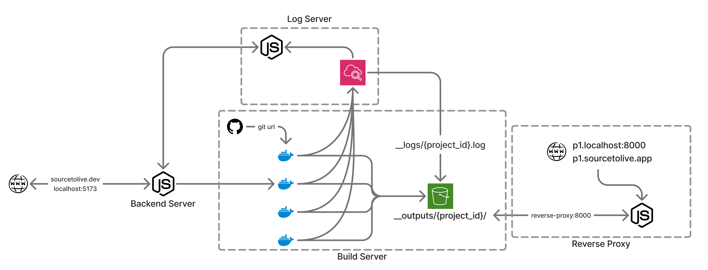

<a id="top"></a>

<div align="center">


[](./LICENSE)


**A Git-to-Live Deployment Platform**
_Transform GitHub repositories into managed projects with one-click deployment_

[Features](#-features) • [Quick Start](#-installation--setup) • [Documentation](#-documentation) • [Contributing](#-contributing)

</div>

---

**SourceToLive** is a Git-to-live deployment platform that transforms connected GitHub repositories into managed projects with one-click deployment. Turn your code into a live application in **three simple steps**: connect a repository, configure your build, and deploy.

## 🚀 Features

<table>
<tr>
<td>

- 🚀 **One-Click Deployment** – Deploy from GitHub in three steps
- 📊 **Live Build Logs** – Real-time build progress streaming
- 🔄 **Automatic Deployments** – GitHub webhook auto-redeploy
- ⚙️ **Build Configuration** – Customize install & build commands
- 🔐 **Environment Variables** – Secure project configuration

</td>
<td>

- 📱 **Project Management** – Dashboard with search & control
- 🔗 **GitHub Integration** – OAuth auth & repository access
- 🌐 **Deployment URLs** – Custom URLs per project
- 👤 **User Profiles** – GitHub connection & account management
- 📚 **In-App Docs** – API & app documentation in UI

</td>
<td>

- 📲 **Responsive Design** – Desktop & mobile support
- ⚡ **Real-time Streaming** – Live log updates
- 🛡️ **Secure Auth** – JWT + OAuth 2.0 support
- 📧 **Email Notifications** – OTP & deployment alerts
- 🌍 **Multi-environment** – Dev, staging, production ready

</td>
</tr>
</table>

---

## 📋 Project Structure

```
 SourceToLive/
 ├── 📁 Backend-Server/          # Node.js/Express API server
 │   ├── config/                 # Configuration management
 │   ├── controllers/            # Request handlers
 │   ├── middleware/             # Auth & verification middleware
 │   ├── models/                 # MongoDB schemas
 │   ├── routes/                 # API route definitions
 │   ├── utils/                  # Helper functions
 │   ├── index.js                # Express app entry point
 │   ├── cloudflared-config.yml
 │   ├── package.json
 │   └── TUNNEL_SETUP.md
 │
 ├── 📁 Build-Server/            # Docker containerized build environment
 │   ├── Dockerfile              # Container definition
 │   ├── main.sh                 # Build orchestration script
 │   ├── script.js               # Build execution logic
 │   └── package.json
 │
 ├── 📁 client/                  # React frontend (Vite)
 │   ├── src/
 │   │   ├── components/         # Reusable React components
 │   │   ├── pages/              # Page-level components
 │   │   ├── App.jsx             # Main app file
 │   │   ├── index.css           # Global styles
 │   │   └── main.jsx            # React entry point
 │   ├── public/                 # Static assets
 │   ├── vite.config.js
 │   ├── eslint.config.js
 │   └── package.json
 │
 ├── 📁 Reverse-Proxy/           # EC2-based reverse proxy for deployed apps
 │   ├── index.js                # Proxy server logic
 │   ├── package.json
 │   └── 404.html
 │
 ├── 📁 Docs/                    # Documentation
 │   ├── images/                 # Architecture diagrams and visuals
 │   │   └── SystemArchitecture.png
 │   ├── APP_DOCUMENTATION.md
 │   ├── API_DOCUMENTATION.md
 │   └── AWS_CONFIGURATION.md
 │
 └── README.md
```

---

## 🛠️ Tech Stack

<table>
<tr>
<th>Frontend</th>
<th>Backend</th>
<th>Infrastructure</th>
</tr>
<tr>
<td valign="top">

- **React 19** – Modern UI rendering
- **Vite** – Next-gen build tool
- **React Router v7** – Client-side routing
- **Tailwind CSS** – Utility-first CSS
- **React Markdown** – Markdown rendering
- **Google OAuth** – Third-party auth

</td>
<td valign="top">

- **Node.js + Express** – REST API
- **MongoDB Atlas** – Document DB
- **JWT** – Stateless authentication
- **AWS SDK** – Cloud integration
- **GitHub OAuth 2.0** – OAuth provider
- **Nodemailer + Resend** – Email
- **Bcrypt** – Password hashing

</td>
<td valign="top">

- **AWS ECS (Fargate)** – Serverless compute
- **AWS CloudWatch** – Log management
- **AWS S3** – File storage
- **AWS EC2** – Reverse proxy
- **Docker** – Containerization
- **GitHub API** – Repository management
- **Cloudflare Tunnel** – Secure access

</td>
</tr>
</table>

### Build System & Additional Tools

- **Docker** – Containerized build environment
- **Morgan** – HTTP request logging
- **CORS** – Cross-origin request handling

---

## 📦 Installation & Setup

### Prerequisites

| Required         | Version            | Link                                                      |
| ---------------- | ------------------ | --------------------------------------------------------- |
| Node.js          | ≥ 18               | [Download](https://nodejs.org/)                           |
| npm or yarn      | Latest             | Comes with Node.js                                        |
| MongoDB Atlas    | Cloud              | [Sign up](https://www.mongodb.com/cloud/atlas)            |
| AWS Account      | Free Tier eligible | [Create account](https://aws.amazon.com/)                 |
| GitHub OAuth App | Free               | [Setup guide](https://docs.github.com/en/apps/oauth-apps) |

### Quick Start with Docker (Recommended)

> **Fastest way to get started** – All services run with one command

```bash
git clone https://github.com/GovindSingh3011/SourceToLive.git
cd SourceToLive
docker-compose up
```

Frontend: http://localhost:5173
Backend: http://localhost:3000
Reverse Proxy: http://localhost:8000

---

### Manual Setup

<table>
<tr>
<td>

> **Important Setup Note**
>
> Use the [AWS Configuration Guide](./Docs/AWS_CONFIGURATION.md) while completing the manual setup below. It is the source of truth for ECS, S3, IAM, CloudWatch, and proxy-related values.

</td>
</tr>
</table>

| AWS Area       | What to Check                                                        |
| -------------- | -------------------------------------------------------------------- |
| Backend Server | `CLUSTER`, `TASK`, `AWS_SUBNETS`, `AWS_SECURITY_GROUPS`, `S3_BUCKET` |
| Build Server   | `AWS_ACCESS_KEY_ID`, `AWS_SECRET_ACCESS_KEY`, `AWS_REGION`           |
| Reverse Proxy  | `PORT`, `BASE_PATH`, `AWS credentials`, `AWS_REGION`                 |

#### 1️⃣ Backend Server Setup

```bash
cd Backend-Server
npm install
```

**Create `.env` file** in `Backend-Server/`:

```env
# 📋 Server Configuration
PORT=3000
NODE_ENV=production
APP_DOMAIN=sourcetolive.app

# ☁️ AWS Configuration
AWS_REGION=us-east-1
CLUSTER=<your-ecs-cluster>
TASK=<your-ecs-task>
AWS_SUBNETS=<comma-separated-subnet-ids>
AWS_SECURITY_GROUPS=<comma-separated-security-group-ids>
S3_BUCKET=<your-s3-bucket>
AWS_ACCESS_KEY_ID=<your-access-key>
AWS_SECRET_ACCESS_KEY=<your-secret-key>

# 🗄️ Database
MONGODB_URI=<your-mongodb-connection-string>

# 🔐 Authentication
JWT_SECRET=<strong-random-secret>

# 📧 Email Configuration
EMAIL_SERVICE=gmail
EMAIL_USER=<your-email>
EMAIL_PASSWORD=<gmail-app-password>
EMAIL_FROM=<sender-name>

# 🌐 OAuth Configuration
GOOGLE_CLIENT_ID=<your-google-client-id>
GITHUB_CLIENT_ID=<your-github-client-id>
GITHUB_CLIENT_SECRET=<your-github-secret>
GITHUB_CALLBACK_URL=https://yourdomain.com/auth/github/callback

# 🔗 CORS & URLs
CORS_ORIGIN=https://sourcetolive.dev
FRONTEND_URL=https://sourcetolive.dev
API_URL=https://api.sourcetolive.dev
```

**Start the backend:**

```bash
npm run dev          # Development
npm start            # Production
```

✅ Backend: **http://localhost:3000**

---

#### 2️⃣ Frontend Setup

```bash
cd client
npm install
```

**Create `.env` file** in `client/`:

```env
# 🔌 API Configuration
VITE_API_URL=http://localhost:3000          # Backend API URL

# 🌐 OAuth Configuration
VITE_GOOGLE_CLIENT_ID=<your-google-client-id>
VITE_GITHUB_CLIENT_ID=<your-github-client-id>
VITE_GITHUB_REDIRECT_URI=http://localhost:5173/auth/github/callback
```

**Start the dev server:**

```bash
npm run dev
```

✅ Frontend: **http://localhost:5173**

---

#### 3️⃣ Build Server Setup _(Optional)_

```bash
cd Build-Server
npm install
docker build -t sourcetolive-build .
```

**Create `.env` file** in `Build-Server/`:

```env
# ☁️ AWS Credentials
AWS_ACCESS_KEY_ID=<your-access-key>
AWS_SECRET_ACCESS_KEY=<your-secret-key>
AWS_REGION=us-east-1
```

---

#### 4️⃣ Reverse Proxy Setup _(Optional)_

```bash
cd Reverse-Proxy
npm install
```

**Create `.env` file** in `Reverse-Proxy/`:

```env
# 🚀 Application Settings
PORT=8000
BASE_PATH=https://sourcetolivebucket.s3.us-east-1.amazonaws.com/__outputs

# ☁️ AWS Credentials
AWS_ACCESS_KEY_ID=<your-access-key>
AWS_SECRET_ACCESS_KEY=<your-secret-key>
AWS_REGION=us-east-1
```

**Start the server:**

```bash
npm run dev
```

✅ Reverse Proxy: **http://localhost:8000**

---

## 🔌 API Routes

### 🔐 Authentication Routes

| Method | Endpoint                        | Description                  |
| ------ | ------------------------------- | ---------------------------- |
| POST   | `/api/auth/register`            | Register new user            |
| POST   | `/api/auth/register/verify`     | Verify OTP & complete signup |
| POST   | `/api/auth/login`               | Login with credentials       |
| POST   | `/api/auth/google`              | Google OAuth login           |
| GET    | `/api/auth/github/oauth`        | Initiate GitHub OAuth        |
| GET    | `/api/auth/github/callback`     | GitHub OAuth callback        |
| GET    | `/api/auth/me`                  | Get current user info        |
| POST   | `/api/auth/github-token`        | Save GitHub token            |
| GET    | `/api/auth/github-token/status` | Check GitHub connection      |
| DELETE | `/api/auth/github-token`        | Disconnect GitHub            |

### 📦 Project Routes

| Method | Endpoint                               | Description                   |
| ------ | -------------------------------------- | ----------------------------- |
| GET    | `/api/project`                         | List all user projects        |
| POST   | `/api/project`                         | Create new project            |
| GET    | `/api/project/:projectId`              | Get project details           |
| PUT    | `/api/project/:projectId`              | Update project config         |
| DELETE | `/api/project/:projectId`              | Delete project                |
| GET    | `/api/project/:projectId/logs/stream`  | Live build logs (EventSource) |
| GET    | `/api/project/:projectId/logs/archive` | Get archived logs             |
| POST   | `/api/project/:projectId/redeploy`     | Trigger manual redeploy       |
| GET    | `/api/project/repositories/github`     | Fetch GitHub repositories     |

### 🔗 Webhook Routes

| Method | Endpoint                          | Description            |
| ------ | --------------------------------- | ---------------------- |
| POST   | `/api/webhook/github/:projectId`  | GitHub webhook trigger |
| POST   | `/api/webhook/gitlab/:projectId`  | GitLab webhook trigger |
| POST   | `/api/webhook/enable/:projectId`  | Enable auto-redeploy   |
| POST   | `/api/webhook/disable/:projectId` | Disable auto-redeploy  |
| GET    | `/api/webhook/status/:projectId`  | Get webhook status     |

---

## 🌐 Frontend Routes

| Route                          | Purpose                        |
| ------------------------------ | ------------------------------ |
| `/`                            | Home / Landing page            |
| `/login`                       | User login                     |
| `/signup`                      | User registration with OTP     |
| `/dashboard`                   | Projects dashboard             |
| `/create-project`              | 3-step deployment wizard       |
| `/project/:projectId`          | Project detail & logs          |
| `/project/:projectId/settings` | Project configuration          |
| `/profile`                     | User account & GitHub settings |
| `/about`                       | About and team page            |
| `/api-docs`                    | API documentation              |
| `/app-docs`                    | App documentation              |

---

## 🏗️ System Architecture

SourceToLive operates as a distributed deployment platform with the following components working in harmony:



**How it works:**

- **GitHub** triggers a webhook when code is pushed
- **Backend Server** receives the event and validates the repository
- **Build Servers** (ECS Fargate) compile and build the project in parallel containers
- **Log Server** (CloudWatch) streams real-time build logs to the dashboard
- **S3 Bucket** stores the compiled output in project directories
- **Reverse Proxy** routes incoming requests to the live deployment
- **Frontend** monitors progress and displays logs to the user

### Architecture Components

| Component          | Role                        | Technology                  |
| ------------------ | --------------------------- | --------------------------- |
| **GitHub**         | Source control & webhooks   | GitHub API + OAuth 2.0      |
| **Backend Server** | API & orchestration         | Node.js + Express + MongoDB |
| **Build Servers**  | Multi-process compilation   | AWS ECS Fargate + Docker    |
| **Log Server**     | Real-time log streaming     | CloudWatch + Node.js        |
| **S3 Storage**     | Build output storage        | AWS S3 + CloudFront         |
| **Reverse Proxy**  | URL routing & delivery      | AWS EC2 + Node.js           |
| **Frontend**       | User dashboard & monitoring | React 19 + Vite + Tailwind  |

---

## 🔐 Authentication

### JWT Bearer Token

All protected API endpoints require this header:

```
Authorization: Bearer <jwt_token>
```

### Supported Authentication Methods

| Method               | Use Case                     | Setup                           |
| -------------------- | ---------------------------- | ------------------------------- |
| **Email + Password** | Traditional signup/login     | Requires JWT secret             |
| **Google OAuth**     | Quick sign-up with Google    | Needs Google Client ID          |
| **GitHub OAuth**     | Repository access & webhooks | Needs GitHub Client ID & Secret |

### Session Management

- 📱 Token stored in browser `localStorage` as `token`
- 🔒 Protected routes redirect to `/login` if unauthenticated
- ⏱️ Token expiration enforced; no automatic refresh

---

## 🚀 Deployment Lifecycle

### Step-by-Step Flow

```
1️⃣ User Creates Project
   ↓
2️⃣ Backend Validates Repo
   ↓
3️⃣ ECS Build Task Queued
   ↓
4️⃣ Build Execution (Docker Container)
   ↓
5️⃣ Live Log Streaming via CloudWatch
   ↓
6️⃣ S3 Upload (Build Output)
   ↓
7️⃣ URL Activation
   ↓
8️⃣ Dashboard Update
```

### Deployment States

| State      | Meaning                                 |
| ---------- | --------------------------------------- |
| `queued`   | Waiting for build to start              |
| `running`  | Build in progress (logs streaming)      |
| `finished` | Build completed, deployment live ✅     |
| `failed`   | Build failed (check logs for errors) ❌ |

---

## 📊 Database Schema

### User Model

```javascript
{
  _id: ObjectId,
  email: String (unique),
  password: String (bcrypt hashed),
  displayName: String,
  avatar: String (URL),
  githubToken: String (encrypted),
  isVerified: Boolean,
  createdAt: Date,
  updatedAt: Date
}
```

### Project Model

```javascript
{
  _id: ObjectId,
  projectId: String (unique per user),
  name: String,
  repositoryUrl: String,
  branch: String (default: 'main'),
  installCommand: String (e.g., 'npm install'),
  buildCommand: String (e.g., 'npm run build'),
  buildOutputDirectory: String (e.g., 'dist/'),
  environmentVariables: Object, // key-value pairs
  owner: { userId: ObjectId },
  status: String ('queued' | 'running' | 'finished' | 'failed'),
  deploymentUrl: String (auto-generated),
  deploymentTimestamps: {
    created: Date,
    started: Date,
    completed: Date
  },
  webhookEnabled: Boolean,
  webhookId: String,
  createdAt: Date,
  updatedAt: Date
}
```

---

## 🧪 Development

### Running All Services Locally

```bash
# Terminal 1 - Backend API
cd Backend-Server
npm run dev

# Terminal 2 - Frontend (another terminal)
cd client
npm run dev

# Terminal 3 - Reverse Proxy (optional)
cd Reverse-Proxy
npm run dev
```

After startup, access:

- **Frontend**: http://localhost:5173
- **Backend API**: http://localhost:3000
- **Reverse Proxy**: http://localhost:8000

### Building for Production

**Frontend:**

```bash
cd client
npm run build    # Output: dist/
npm run preview  # Preview production build
```

**Backend:**

- No build needed; runs Node.js directly

### Code Quality & Linting

**Frontend:**

```bash
cd client
npm run lint     # Run ESLint
npm run lint:fix # Fix lint issues
```

---

## 📚 Documentation

- **[App Documentation](./Docs/APP_DOCUMENTATION.md)** – User-facing feature guide
- **[API Documentation](./Docs/API_DOCUMENTATION.md)** – Comprehensive API reference
- **[AWS Configuration Guide](./Docs/AWS_CONFIGURATION.md)** – Full AWS setup for ECS, S3, IAM, and CloudWatch

Browse documentation directly in the app at `/api-docs` and `/app-docs`.

---

## 🤝 Contributing

We welcome contributions! Follow these steps to contribute:

### 1. Fork & Clone

```bash
git clone https://github.com/GovindSingh3011/SourceToLive.git
cd SourceToLive
git checkout -b feature/your-feature
```

### 2. Make Changes & Commit

Make your changes and commit using conventional commit format:

```bash
git commit -m "feat(scope): description of your feature"
```

### 3. Push & Create PR

```bash
git push origin feature/your-feature
```

Then open a Pull Request on GitHub with a clear description of your changes.

### Commit Message Guidelines

Follow **Conventional Commits** format:

```
<type>(<scope>): <subject>

- feat: New feature
- fix: Bug fix
- docs: Documentation changes
- style: Code style (no logic changes)
- refactor: Code refactoring
- test: Adding or updating tests
- chore: Build, dependencies, tooling
```

**Examples:**

```
feat(auth): add GitHub OAuth login
fix(dashboard): resolve project search filtering
docs: update API documentation
refactor(api): simplify error handling
```

---

## 📋 Roadmap

### Current Limitations ⚠️

- ❌ No rollback to previous deployments
- ❌ Single deployment per project (overwrites on redeploy)
- ❌ No team collaboration or shared projects
- ❌ No build caching or optimization
- ❌ No custom domains (CNAME support)
- ❌ No advanced monitoring or metrics

### Planned Features 🚀

| Feature                            | Status  | Priority |
| ---------------------------------- | ------- | -------- |
| Deployment Rollback                | Planned | High     |
| Team Collaboration                 | Planned | High     |
| Build Caching                      | Planned | Medium   |
| Custom Domain Support              | Planned | Medium   |
| Advanced Monitoring & Alerts       | Planned | Medium   |
| Email Notifications                | Planned | Medium   |
| Staging Environments               | Planned | Low      |
| AI-Powered Platform Guidance (RAG) | Planned | Low      |

---

## 🔒 Security & Privacy

### Security Measures

| Feature                   | Implementation                                 |
| ------------------------- | ---------------------------------------------- |
| **Passwords**             | Hashed with bcrypt (salt rounds: 10)           |
| **Tokens**                | JWT encrypted at rest and in transit           |
| **GitHub Tokens**         | Encrypted in MongoDB before storage            |
| **Environment Variables** | Secure storage (TODO: add encryption at rest)  |
| **CORS**                  | Origin validation on all cross-origin requests |
| **HTTPS/TLS**             | All production connections encrypted           |
| **Input Validation**      | All user inputs validated before processing    |
| **XSS Protection**        | Content security policy headers                |

### Best Practices for Users

- ✅ Use strong, unique passwords
- ✅ Enable 2FA on GitHub and connected accounts
- ✅ Regularly rotate access tokens
- ✅ Use HTTPS in production
- ✅ Keep dependencies updated
- ✅ Review environment variables permissions

---

## 👥 Team

SourceToLive is developed by a team of developers focused on implementing real-world deployment workflows, cloud infrastructure, and scalable application delivery while continuously learning and evolving.

| Contributor        | LinkedIn                                                           | GitHub Profile                                           |
| ------------------ | ------------------------------------------------------------------ | -------------------------------------------------------- |
| Govind Singh       | [LinkedIn](https://www.linkedin.com/in/govindsingh3011/)           | [@GovindSingh3011](https://github.com/GovindSingh3011)   |
| Soumya Kumar Gupta | [LinkedIn](https://www.linkedin.com/in/soumyakumargupta/)          | [@soumyakumargupta](https://github.com/soumyakumargupta) |
| Vansh Agarwal      | [LinkedIn](https://www.linkedin.com/in/vansh-agarwal-66771925a/)   | [@Vanshagarwl](https://github.com/Vanshagarwl)           |
| Aviral Mishra      | [LinkedIn](https://www.linkedin.com/in/aviral-mishra-bb5706262/)   | [@AVIRALMISHRA1](https://github.com/AVIRALMISHRA1)       |
| Akshat Kushwaha    | [LinkedIn](https://www.linkedin.com/in/akshat-kushwaha-08a448274/) | [@akshatkushwaha03](https://github.com/akshatkushwaha03) |
| Jatin Kumar        | [LinkedIn](https://www.linkedin.com/in/jatin-kumarx-54734524a/)    | [@Jatin-kumarx](https://github.com/Jatin-kumarx)         |

---
## ⚖️ Legal Notice

This repository is intended for learning, reference, and non-commercial exploration.  
Unauthorized commercial usage, reproduction, or deployment of this project is not permitted without prior authorization.

## 📄 License

This project is licensed under the **SourceToLive Custom License**.  
Usage for commercial purposes requires prior permission from the Primary Developer.

---

## 📞 Support & Feedback

### Getting Help

- 📖 **[App Documentation](./Docs/APP_DOCUMENTATION.md)** – User guide & features
- 🔌 **[API Documentation](./Docs/API_DOCUMENTATION.md)** – API reference & examples
- 🛠️ **[AWS Configuration Guide](./Docs/AWS_CONFIGURATION.md)** – Step-by-step AWS setup
- 🐛 **[Open an Issue](https://github.com/GovindSingh3011/SourceToLive/issues)** – Report bugs or suggest features
- 💬 **Check existing issues** – Your question might already be answered

### Contributing

Found a bug? Want to add a feature? Contributions are welcome!
See [Contributing](#-contributing) section above for guidelines.

---

<div align="center">

### ⭐ If you find SourceToLive helpful, please give us a star!

```
Deploy your code with confidence. SourceToLive makes it simple.
```

**Last Updated:** April 9, 2026
**Version:** 1.0
**Status:** Production Ready ✅

---

© 2026 SourceToLive. All rights reserved.  

[Back to top](#top)

</div>
